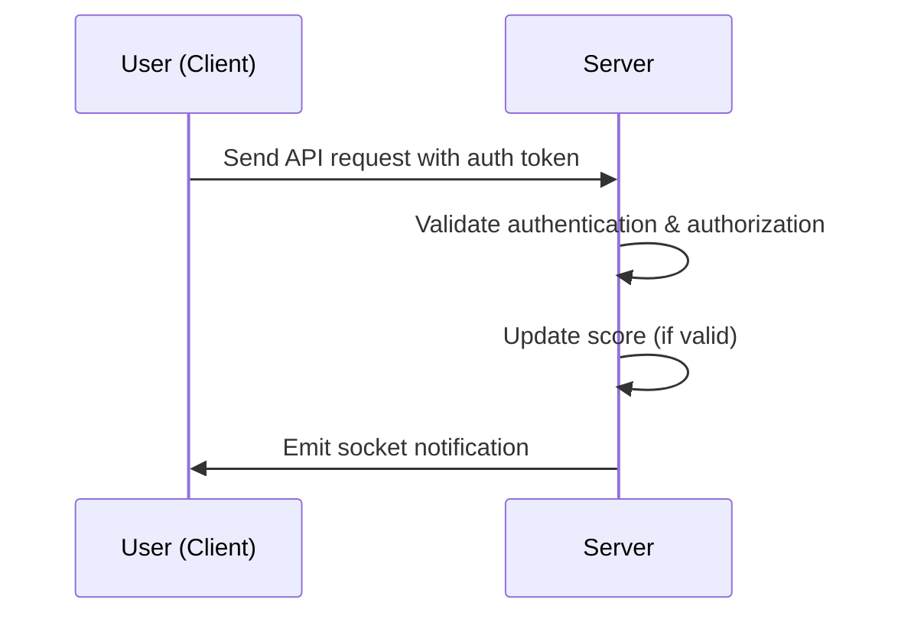

# API Service Module for Scoreboard

## Introduction
This API module is built using Node.js and MongoDB. Its purpose is to update user scores and display a real-time scoreboard showcasing the top 10 users. Every time a user performs an action (the specific action details are not critical), their score increases and an API call is triggered to update the score. The system also verifies user authentication to prevent unauthorized score increases.

## Functional Requirements
1. **Display Scoreboard:**  
   - The website displays a scoreboard featuring the top 10 users by score.
   - The scoreboard is updated in real-time.

2. **Update User Score:**  
   - A user performs an action (the action details are not important).
   - Upon completion of the action, the user's score is increased.
   - An API call is made to the backend server to update the score.

3. **Security and Fraud Prevention:**  
   - The API requires user authentication (e.g., using JWT) to ensure only authorized users can update scores.
   - Security measures such as rate limiting and input validation are applied to prevent unauthorized score manipulation.

## System Architecture
The API module includes the following key components:
- **API Endpoint:** Receives and processes score update requests from the client.
- **Authentication & Authorization:** Verifies the user's token (e.g., JWT) to confirm user permissions.
- **Business Logic:** Checks the validity of the action and updates the score.
- **Database Layer:** Utilizes MongoDB to store and query score data.
- **Real-Time Notification:** After updating the score, the system notifies the client via WebSocket or similar service to refresh the scoreboard.

## Execution Flow Diagram

## Additional Improvements
- **Caching:**  
  Implement caching strategies for the scoreboard data to reduce database load and improve response times.
  
- **Rate Limiting:**  
  Enforce rate limits on the API endpoints to mitigate potential DDoS attacks and abuse.

- **Logging:**  
  Integrate logging to track API calls and monitor system behavior, which can help in diagnosing issues and detecting anomalies.

- **Scalability:**  
  Design the module with scalability in mind, possibly leveraging a microservices architecture or event-driven design (using message queues) to handle increased user traffic.

- **Validation & Sanitization:**  
  Rigorously validate and sanitize all incoming data to prevent injection attacks and ensure system integrity.